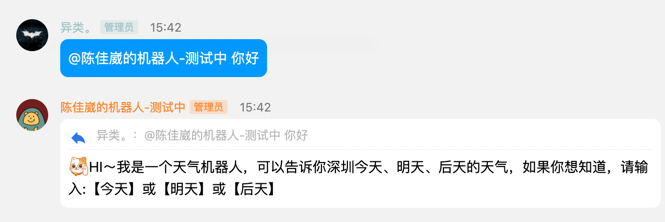
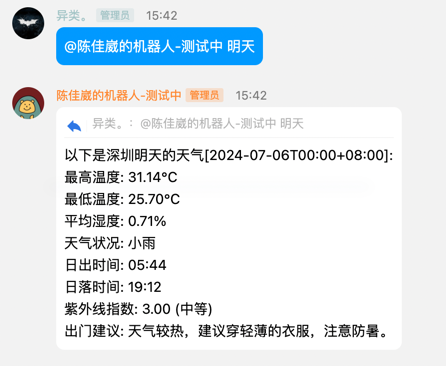
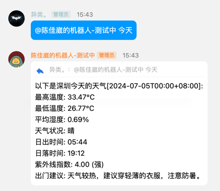

# 项目名称
陈佳崴的测试机器人

## 功能介绍
添加机器人进入频道后，@机器人，并且进行相关对话。
可以根据输入的日期返回相关天数的深圳天气，目前支持的天数为：今天、明天、后天。
若遇到其他输入，会输出机器人相关提示。

使用case如下：
默认回复：

合理的天数输入：

## 方案设计
根据官方go SDK接入频道机器人通信能力。
根据彩云api能力，实现天气预报数据获取，同时根据天气情况，如温度、天气状况等，输入相关的出行建议。
详细代码见代码库，weather目录下，以及main文件。

## 测试
在weather目录下执行go test 命令

